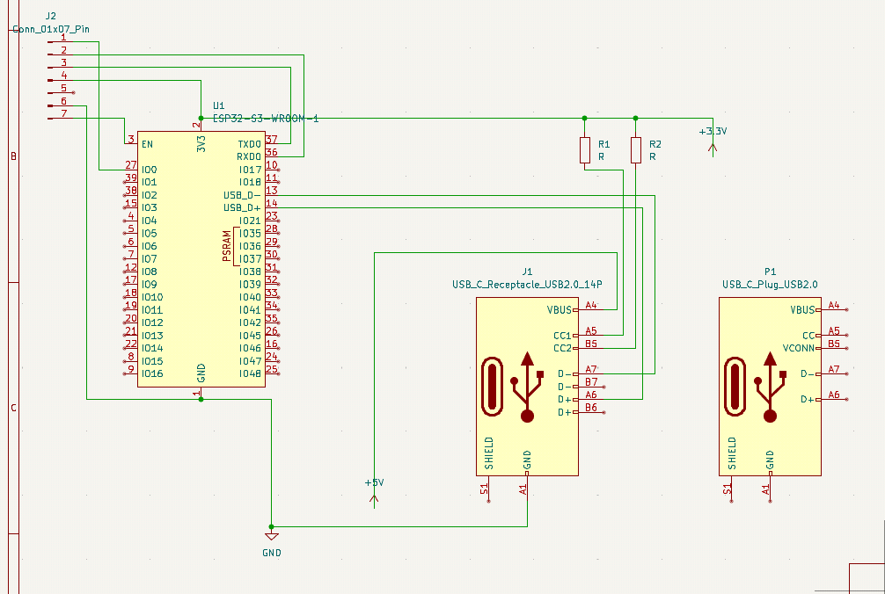
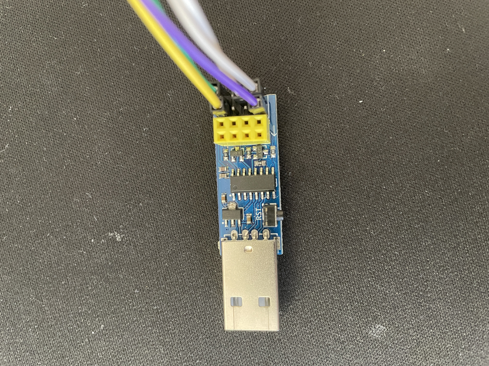

# May 21: Researching components

Researched a bunch of components I can use that support Bluetooth Low Energy and the Human Interface Device protocol:

|        | **nRF52840**                                                   | **ESP32-S3**                                         | **STM32**                                                       |
|--------|----------------------------------------------------------------|------------------------------------------------------|-----------------------------------------------------------------|
| **Pros** | - Ultra low battery usage   - Mature BLE HID ecosystem, great SDK   - Low cost | - Dual-core!   - Wi-Fi integration as well as BLE   - Low cost | - Low power   - Tons of features, products, ecosystem   - Industry standard |
| **Cons** | - No USB host support   - Needs external chip (e.g., MAX3421E) for USB host | - More power hungry | - Much harder to learn   - Slightly more expensive |

Ultimately, I decided on the ESP32-S3, and bought a devboard!

**Total time spent: 1h**

# May 22: Reading datasheets

Ultimately settled for an ESP32-S3 module (the WROOM-1), because it comes with built in antenna, crystal oscillator, flash memory, and even FCC certification (not that I would've cared). Read so many [datasheets](https://www.espressif.com/sites/default/files/documentation/esp32-s3-wroom-1_wroom-1u_datasheet_en.pdf) about the module, looking at its pin diagrams, USB functionality, UART flashing, etc. For example, the GPIO0 pin has to be pulled low to enter download mode, the U0TXD and U0RXTD have to be configured for UART flashing, and the EN pin to reset the board. This meant that I needed to break out certain pins just for flashing.

USB was a bit more complex. I had to look into USBC 2.0 spec (wtf is CC1, CC2, and VCONN) and connect the USB-OTG module of my ESP module to a plug. Still working on a way just to have the male end that can directly plug into my keyboard but I think I might be breaking USB spec.
Made a little design in KiCAD:

Total time spent: 3h

## May 23: Hardware Hunting

I needed a dev board to test out the functioanlity (connecting over bluetooth, reading the USB signals, etc). My ESP32-S3 devboard is still being shipped, so in the meantime, I had to ~~steal~~borrow one of my friend's ESP32. Although it doesn't support USB OTG (On The Go), the feature I ned to make my module a USB host and intercept the keyboard's signals, I was still able to test out the BLE HID (Bluetooth Low Energy Human Interface Device) to simulate keypresses wirelessly!

First, I needed to figure out a way to proram it. I dug up an ESP Prog lying around in my hardware kit, and connected the UART pins (RX => TX0, TX => RX0). To flash the code you needed to hold down the BOOT pin while pressing the EN (reset) pin to enter bootloader mode. After the code is flashed, the EN pin must eb pressed once again to start running the new code.

I flashed code that printed "Hello World" to serial, confirming I was able to wire everything properly!

Total time spent: 1h