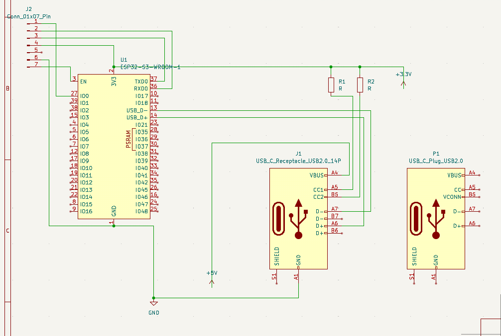
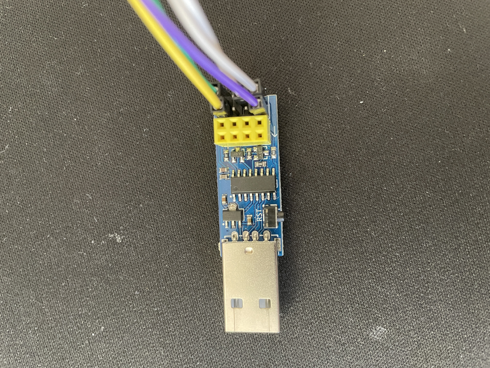
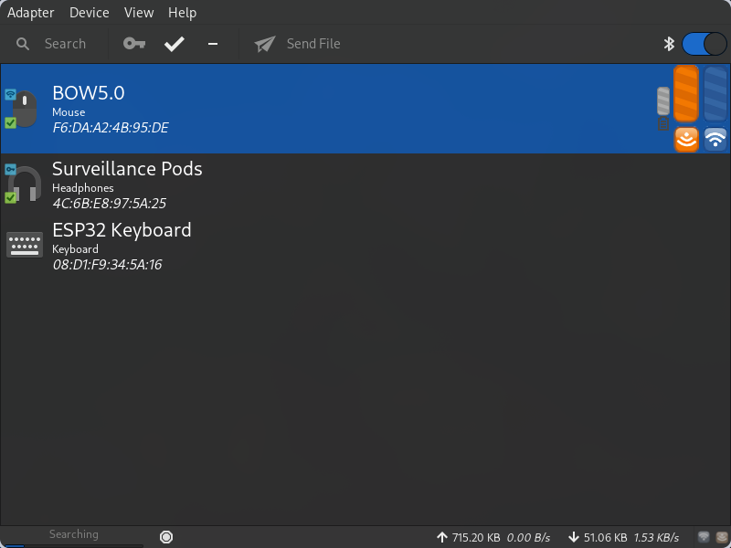
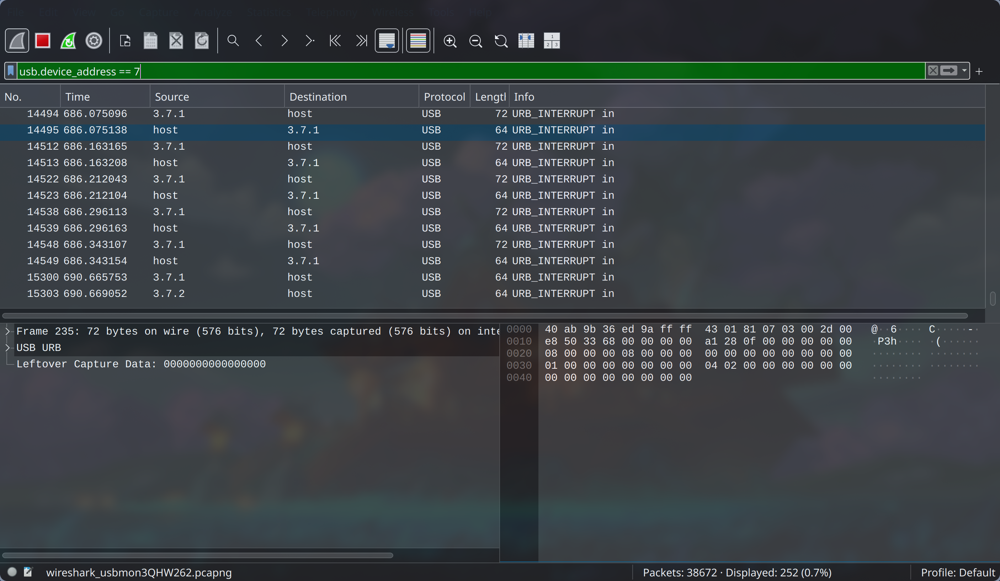
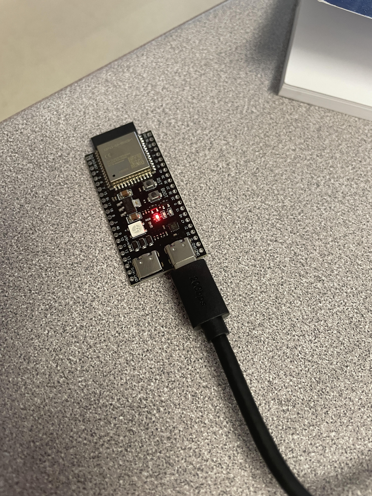

# May 21: Researching components

Researched a bunch of components I can use that support Bluetooth Low Energy and the Human Interface Device protocol:

|          | **nRF52840**                                                                         | **ESP32-S3**                                                         | **STM32**                                                                         |
| -------- | ------------------------------------------------------------------------------------ | -------------------------------------------------------------------- | --------------------------------------------------------------------------------- |
| **Pros** | - Ultra low battery usage   - Mature BLE HID ecosystem, great SDK   - Low cost | - Dual-core!   - Wi-Fi integration as well as BLE   - Low cost | - Low power   - Tons of features, products, ecosystem   - Industry standard |
| **Cons** | - No USB host support   - Needs external chip (e.g., MAX3421E) for USB host       | - More power hungry                                                  | - Much harder to learn   - Slightly more expensive                             |

Ultimately, I decided on the ESP32-S3, and bought a devboard!

**Total time spent: 1h**

# May 22: Reading datasheets

Ultimately settled for an ESP32-S3 module (the WROOM-1), because it comes with built in antenna, crystal oscillator, flash memory, and even FCC certification (not that I would've cared). Read so many [datasheets](https://www.espressif.com/sites/default/files/documentation/esp32-s3-wroom-1_wroom-1u_datasheet_en.pdf) about the module, looking at its pin diagrams, USB functionality, UART flashing, etc. For example, the GPIO0 pin has to be pulled low to enter download mode, the U0TXD and U0RXTD have to be configured for UART flashing, and the EN pin to reset the board. This meant that I needed to break out certain pins just for flashing.

USB was a bit more complex. I had to look into USBC 2.0 spec (wtf is CC1, CC2, and VCONN) and connect the USB-OTG module of my ESP module to a plug. Still working on a way just to have the male end that can directly plug into my keyboard but I think I might be breaking USB spec.
Made a little design in KiCAD:

Total time spent: 3h

## May 23: Hardware Hunting

I needed a dev board to test out the functioanlity (connecting over bluetooth, reading the USB signals, etc). My ESP32-S3 devboard is still being shipped, so in the meantime, I had to ~~steal~~borrow one of my friend's ESP32. Although it doesn't support USB OTG (On The Go), the feature I ned to make my module a USB host and intercept the keyboard's signals, I was still able to test out the BLE HID (Bluetooth Low Energy Human Interface Device) to simulate keypresses wirelessly!

First, I needed to figure out a way to proram it. I dug up an ESP Prog lying around in my hardware kit, and connected the UART pins (RX => TX0, TX => RX0). To flash the code you needed to hold down the BOOT pin while pressing the EN (reset) pin to enter bootloader mode. After the code is flashed, the EN pin must eb pressed once again to start running the new code.

I flashed code that printed "Hello World" to serial, confirming I was able to wire everything properly!

Total time spent: 1h

## May 24: Platformio Migration

I got platformio working, because I wanted to use an actual IDE like VSCode instead of Arduino IDE. I found an ESP32 BLE HID library that I imported, and ran the example program. I tried to get it to work in Neovim, but the LSP kept throwing me errors. Will try again tomorrow.

I was able to connect with it through bluetooth, and it was able to type in "Hello World"!

Total time spent: 2h

## May 25: USB debugging

I wanted to actually look into the USB HID signals that the keyboard was sending, so I installed wireshark to analyze the packets. Setting up the USB debugging on Linux was a bit painful, involving enabling the `usbmon` kernel module (sudo modprobe usbmon), adding myself to the `wireshark` group and adding the `wireshark` group to `/dev/usbmon*`.

In the end, I was able get my keyboard plugged in and have wireshark inspect the packets!

Sample packet for pressing the `a` key:
0000   80 7c 25 48 ec 9a ff ff 43 01 81 09 03 00 2d 00
0010   9c 53 33 68 00 00 00 00 81 8c 0c 00 00 00 00 00
0020   08 00 00 00 08 00 00 00 00 00 00 00 00 00 00 00
0030   01 00 00 00 00 00 00 00 04 02 00 00 00 00 00 00
0040   00 00 04 00 00 00 00 00

Sample packet for pressing the `b` key:
0000   80 7c 25 48 ec 9a ff ff 43 01 81 09 03 00 2d 00
0010   af 53 33 68 00 00 00 00 17 b7 01 00 00 00 00 00
0020   08 00 00 00 08 00 00 00 00 00 00 00 00 00 00 00
0030   01 00 00 00 00 00 00 00 04 02 00 00 00 00 00 00
0040   00 00 05 00 00 00 00 00

Sample packet for pressing the `z` key
0000   80 7c 25 48 ec 9a ff ff 43 01 81 09 03 00 2d 00
0010   cd 53 33 68 00 00 00 00 82 b1 00 00 00 00 00 00
0020   08 00 00 00 08 00 00 00 00 00 00 00 00 00 00 00
0030   01 00 00 00 00 00 00 00 04 02 00 00 00 00 00 00
0040   00 00 1d 00 00 00 00 00

In the Bluetooth HID spec, a is mapped as 0x04, b is mapped as 0x05, z is mapped as 0x1d. This matches the bits at 0x43.

Pressing down all three of the keys simulatneously gives:
0000   80 7c 25 48 ec 9a ff ff 43 01 81 09 03 00 2d 00
0010   d5 54 33 68 00 00 00 00 e8 4d 01 00 00 00 00 00
0020   08 00 00 00 08 00 00 00 00 00 00 00 00 00 00 00
0030   01 00 00 00 00 00 00 00 04 02 00 00 00 00 00 00
0040   00 00 04 05 1d 00 00 00

So it seems that the USB HID sends all key presses from 0x43 onwards, and sends 00 to indicate key releases.

I tested my Bluetooth keyboard, and it works on my phone! Planning on writing a python script to forward my keypresses to the Bluetooth keyboard as a proof of concept.

Got neovim LSP support with clangd (painfully). Required editing the platformio.ini file to properly generate the compile_commands.json, as well as manually including the BLE library (which wasn't included automatically for some reason??)

Time spent: 1h

## May 26: Basic Prototype (ish)!

I wrote a python script to capture my keyboard's input events through `evdev`. Took a while, attempted with `pynput` but it didn't work (X11 vs Wayland again), tried with pyUSB but that didn't work, ultimately settled for evdev reading through the `/dev/input/eventX`

It takes in the keyboard events and translates them into the appropriate ASCII value or special key value described [here](https://docs.arduino.cc/language-reference/en/functions/usb/Keyboard/keyboardModifiers/), and sends it over pyserial. 

I have the keyboard plugged into my laptop running the python script, and the ESP plugged into my laptop to receive the serial input. The bluetooth keyboard is connected to my phone, so it's able to type whatever I'm typing. This journal is currently being written on my laptop, and also on my phone through the bluetoth keyboard.

Now that I have a working protoype that can read in the keyboard events and send them over, I just need to do it all on one microcontroler and avoid the laptop intermediary in total!

Still waiting on my ESP32-S3 devkit to arrive, in the meantime, this will do!

Total time spent: 1.5hrs

## May 29: ESP32-S3 ARRIVED!!!

The module finally arrived!

To use USB OTG, I have to switch from the Arduino framework to the ESP-IDF framework. Wrote a basic Hello World to get familiar with it. FreeRTOS seems cool. Spent the rest of the time reading the [examples](https://github.com/espressif/esp-idf/tree/master/examples/peripherals/usb/host/hid)

Time spent: 1hrs

